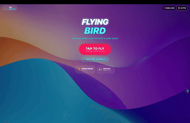

# 🐦 FlyingBird Pro

<div align="center">
  <video src="./demo/demo_draft1.mov" controls="controls" width="400"></video>
  <br />
  <em>(Wait for the video to load, or check out the cool GIF below!)</em>
  <br />
  
</div>

Welcome to **FlyingBird Pro**, the coolest flying adventure made by kids, for kids! Help your favorite animals fly through the sky and dodge the tricky obstacles. 

Now all your animal friends are packed right into the game! That means no waiting for pictures to load, and you don't even need the internet to see them! 

## 🔥 Super Fun Features

- **Play Anywhere!** You can play on a computer (Web), or on a tablet or phone (iOS and Android). The fun never stops!
- **Robot Autopilot! 🤖** Do you want to see a robot play? Turn on the Autopilot Robot from the main menu and watch it do perfect jumps! It can see into the future to clear the hardest gaps!
- **Cool Worlds! 🌍** The world changes color and style every time you score 10 points!
- **Animal Friends! 🐅🐓** We just added lots of awesome new animal pictures that load super fast, so the game is quicker and more reliable than ever! 
- **Leaderboards! 🥇** Compete to see who the best high-scorer is!

---

## 🚀 How to Play (Ask a Grown-up if you need help starting!)

### 1. Get the Game Ready
Open your terminal and type:
```bash
npm install
```

### 2. 🌍 Play on the Computer (Easiest!)
This opens the game right in your web browser!
```bash
npm run web
```

### 3. 📱 Play on a Phone or Tablet
Use these commands to play on mobile devices:
```bash
npm run ios
# or
npm run android
```

---

## 🧪 Testing Magic

Do you want to see the computer check the game for bugs all by itself? 

**Fast Checks (Unit Tests):**
```bash
npm run test
```

**Robot Playwright Check (End-to-End Tests):**
Watch the computer play the game on its own to make sure it's working! Have the web server running, then type:
```bash
npm run test:e2e
# or to watch the magic happen:
npm run test:e2e:ui
```

---

## ☕ Support the Awesome Developers!
If you love flying with us or enjoy watching the robot do crazy tricks, you can support us here:
[Support FlyingBird!](https://ko-fi.com/flyingbirdalways)
